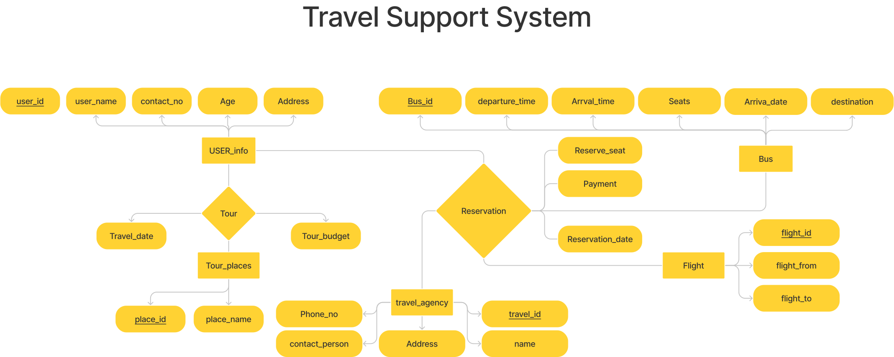

# DATABASE_MANAGEMENT_SYSTEM

- ## [CLASS](CLASS)
  - [CLASS-02](CLASS/CLASS-02.sql)
  - [CLASS-03](CLASS/CLASS-03.sql)
  - [CLASS-04](CLASS/CLASS-04.sql)
  - [CLASS-05](CLASS/CLASS-05.sql)
  - [CLASS-06](CLASS/CLASS-06.sql)
  - [CLASS-07](CLASS/CLASS-07.sql)
  - [CLASS-08](CLASS/CLASS-08.sql)
  - [CLASS-09](CLASS/CLASS-09.sql)
  - [CLASS-10](CLASS/CLASS-10.sql)
  - [CLASS-11](CLASS/CLASS-11.sql)
  - [CLASS-12](CLASS/CLASS-12.sql)
  - [CLASS-13](CLASS/CLASS-13.sql)
- ## [ERD](ERD)
  - 
  - 
  - 
  - 
  - 
- ## [PROPERTY_MANAGEMENT_SYSTEM](PROPERTY_MANAGEMENT_SYSTEM)
  - ### FINAL PROJECT [PROPERTY_MANAGEMENT_SYSTEM ERD]
    
  - ### [PROPERTY_MANAGEMENT_SYSTEM - Click ME](https://tahsin000.github.io/DATABASE_MANAGEMENT_SYSTEM/PROPERTY_MANAGEMENT_SYSTEM/FINAL%20PROJECT%20REPORT/MAIN_PROJECT.html) 
